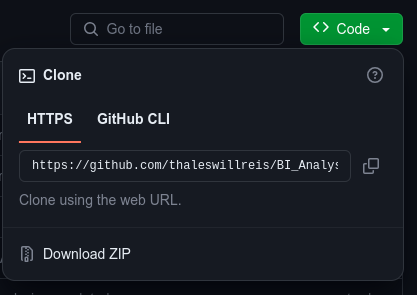

# BI_Analysis-Sales

Projeto destinado a limpeza, tratamento e análise de dados de uma empresa de varejo, com sede no Reino Unido e que iniciou a expanção das suas operações de vendas para outros países.

## Insights

* Quantidade de faturas de cada país;
* Porcentual da quantidade de vendas de cada país;
* Porcentual do valor total de vendas de cada mercado;
* Valor total em vendas de cada mercado;
* Valor médio do ticket de cada país;
* Valor mínimo do ticket de cada país;
* Valor máximo do ticket de cada país;
* Maiores mercados em ticket médio, valor total e quantidade de vendas;
* Menores mercados em ticket médio, valor total e quantidade de vendas;
* Performance do total das vendas mês a mês;
* Mercados mais performáticos mês a mês;
* Média do valor total de vendas mês a mês;
* Média da quantidade de faturas mês a mês;
* Mádia do valor de ticket mês a mês;
* Porcentual do valor total de devoluções de cada mercado;
* Valor total em devoluções de cada mercado;
* Mercados com o menor valor em devoluções;
* Mercados com o maior valor em devoluções;
* Relação entre o Total de Vendas e o Total de Devoluções por País;
* Clientes com a maior quantidade de faturas e valor médio das faturas;
* Fidelidade dos clientes do mercado interno;
* Fidelidade dos clientes do mercado externo;
* Países com maior porcentagem de clientes recorrentes;

## Tecnologias Utilizadas

Esse projeto foi executado utilizando a linguagem Python no formato Jupyter Notebook. Foram utilizadas as bibliotecas Pandas (Carregamento, Limpeza e Análise dos Dados), Matplotlib e Seaborn (Visualização de dados e geração de gráficos), Git (Versionamento de código) e a IDE escolhida foi o Visual Studio Code, rodando em um Debian Linux.

Links relacionados:

* [Debian Linux](https://www.debian.org/index.pt.html)
* [VSCode](https://code.visualstudio.com/)
* [Python](https://www.python.org/)
* [Jupyter](https://jupyter.org/)
* [Pandas](https://pandas.pydata.org/)
* [Matplotlib](https://matplotlib.org/)
* [Seaborn](https://seaborn.pydata.org/#)
* [Git](https://git-scm.com/)

### Dependências e Versões Necessárias

Os softwares e bibliotecas utilizados no projetos tinham a seguintes versões:

* Python - Versão: 3.11.5
* Pandas - Versão: 2.1.4
* Matplotlib - Versão: 3.8.0 (matplotlib-inline: 0.1.6)
* Seaborn - Versão: 0.12.2

## Como rodar o projeto

Para rodar o projeto os seguintes métodos podem ser utilizados:

#### *Método 1:* Fazer o download do projeto

**Passo 1:**

Na pagina principal do projeto [https://github.com/thaleswillreis/BI_Analysis-Sales/tree/main](https://github.com/thaleswillreis/BI_Analysis-Sales/tree/main), busque pelo botão verde contendo o nome "<> Code".



**Passo 2:**

Clique em "Download ZIP"

**Passo 3:**

Desconpacte a pasta que você terminaou de baixar.

**Passo 4:**

Abra os projetos contendo a extenção ".ipynb".

#### *Método 2:* Clonar o repositório

Obs: Antes de proceder com esse processo, certifique-se de que o GitHub está devidamente configurado no seu computador.

**Passo 1:**

Crie uma pasta na qual você tenha permissão de escrita.

**Passo 2:**

Abra um terminal a partir da pasta recém criada ou nevegue até ela pelo terminal.

**Passo 3:**

Na pagina principal do projeto [https://github.com/thaleswillreis/BI_Analysis-Sales/tree/main](https://github.com/thaleswillreis/BI_Analysis-Sales/tree/main), busque pelo botão verde contendo o nome "<> Code". (Ver imagem no método anterior)

**Passo 4:**

Copie a URL do repositório.


**Passo 5:**

No terminal digite:

```
git Clone https://github.com/thaleswillreis/BI_Analysis-Sales.git
```

Aguarde a clonagem do repositório terminar.

**Passo 6:**

Abra os projetos contendo a extenção ".ipynb".

## Problemas enfrentados

O código poderá enfrentar problemas ao ser executado utilizando versões diferentes de linguagem e bibliotecas. Certifique-se de que as versões listadas no ítem "Dependências e Versões Necessárias" estão corretamente instaladas.

Caso já exista um ambiente de desenvolvimento com versões diferentes em uso na máquina utilizada, uma boa alternativa seria a criação de uma ambiente virtual de desenvolvimento. Em caso de dúvida, segue o link da documentação.
[Ambientes virtuais e pacotes](https://docs.python.org/pt-br/3/tutorial/venv.html)

## Considerações Finais

Caso esse conteúdo seja útil para você, tenha alguma dúvida ou queira contribuir com alguma melhoria, deixe seu comentário ou contribua com o projeto.