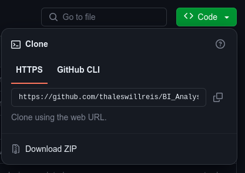
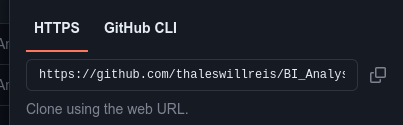

# BI_Analysis-Sales

Project aimed at cleaning, processing, and analyzing data from a retail company based in the United Kingdom that has started expanding its sales operations to other countries.

## Insights

* Number of invoices from each country;
* Percentage of sales quantity from each country;
* Percentage of the total sales value from each market;
* Total sales value for each market;
* Average ticket value for each country;
* Minimum ticket value for each country;
* Maximum ticket value for each country;
* Top markets in average ticket value, total value, and quantity of sales;
* Bottom markets in average ticket value, total value, and quantity of sales;
* Performance of total sales month by month;
* Most performing markets month by month;
* Average total sales value month by month;
* Average quantity of invoices month by month;
* Average ticket value month by month;
* Percentage of total returns value from each market;
* Total returns value for each market;
* Markets with the lowest returns value;
* Markets with the highest returns value;
* Relationship between Total Sales and Total Returns by Country;
* Customers with the highest quantity of invoices and average invoice value;
* Loyalty of domestic market customers;
* Loyalty of international market customers;
* Countries with the highest percentage of recurring customers.

## Technologies Used

This project was executed using the Python language in Jupyter Notebook format. The following libraries were used: Pandas (Data Loading, Cleaning, and Analysis), Matplotlib, and Seaborn (Data Visualization and Graph Generation), Git (Code Versioning), and the chosen IDE was Visual Studio Code, running on Debian Linux.

Related links:

* [Debian Linux](https://www.debian.org/index.pt.html)
* [VSCode](https://code.visualstudio.com/)
* [Python](https://www.python.org/)
* [Jupyter](https://jupyter.org/)
* [Pandas](https://pandas.pydata.org/)
* [Matplotlib](https://matplotlib.org/)
* [Seaborn](https://seaborn.pydata.org/#)
* [Git](https://git-scm.com/)

### Dependencies and Required Versions

The software and libraries used in the project had the following versions:

* Python - Version: 3.11.5
* Pandas - Version: 2.1.4
* Matplotlib - Version: 3.8.0 (matplotlib-inline: 0.1.6)
* Seaborn - Version: 0.12.2

## How to Run the Project

To run the project, the following methods can be used:

#### *Method 1:* Download the project

**Step 1:**

On the project's main page [https://github.com/thaleswillreis/BI_Analysis-Sales/tree/main](https://github.com/thaleswillreis/BI_Analysis-Sales/tree/main), look for the green button containing the name "<> Code".



**Step 2:**

Click on "Download ZIP".

**Step 3:**

Extract the folder you just downloaded.

**Step 4:**

Open the projects with the ".ipynb" extension.

#### *Method 2:* Clone the repository

Note: Before proceeding with this process, make sure that GitHub is properly configured on your computer.

**Step 1:**

Create a folder where you have write permission.

**Step 2:**

Open a terminal from the newly created folder or navigate to it through the terminal.

**Step 3:**

On the project's main page [https://github.com/thaleswillreis/BI_Analysis-Sales/tree/main](https://github.com/thaleswillreis/BI_Analysis-Sales/tree/main), look for the green button containing the name "<> Code". (See image in the previous method)

**Step 4:**

Copy the repository URL.



**Step 5:**

In the terminal, type:

```
git Clone https://github.com/thaleswillreis/BI_Analysis-Sales.git
```

Wait for the repository cloning to finish.

**Step 6:**

Open the projects with the ".ipynb" extension.

## Issues Faced

The code may encounter problems when executed using different language and library versions. Make sure that the versions listed in the "Dependencies and Required Versions" item are correctly installed.

If there is already a development environment with different versions in use on the machine, a good alternative would be to create a virtual development environment. If in doubt, here is the link to the documentation.
[Virtual Environments and Packages](https://docs.python.org/3/tutorial/venv.html)

## Final Considerations

If this content is helpful for you, if you have any questions, or if you want to contribute to any improvements, leave your comment or contribute to the project.